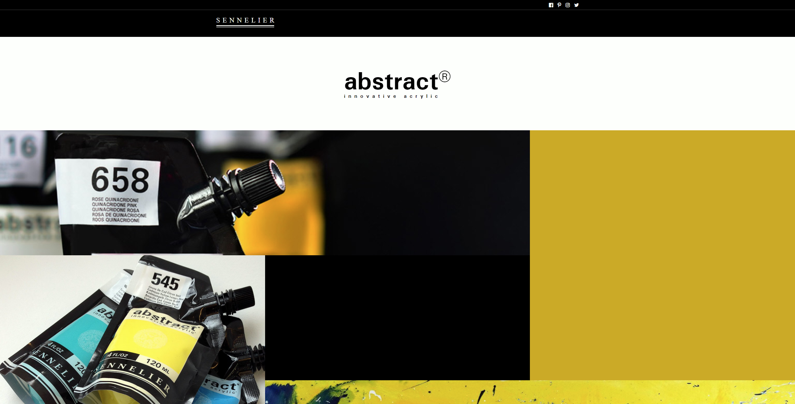
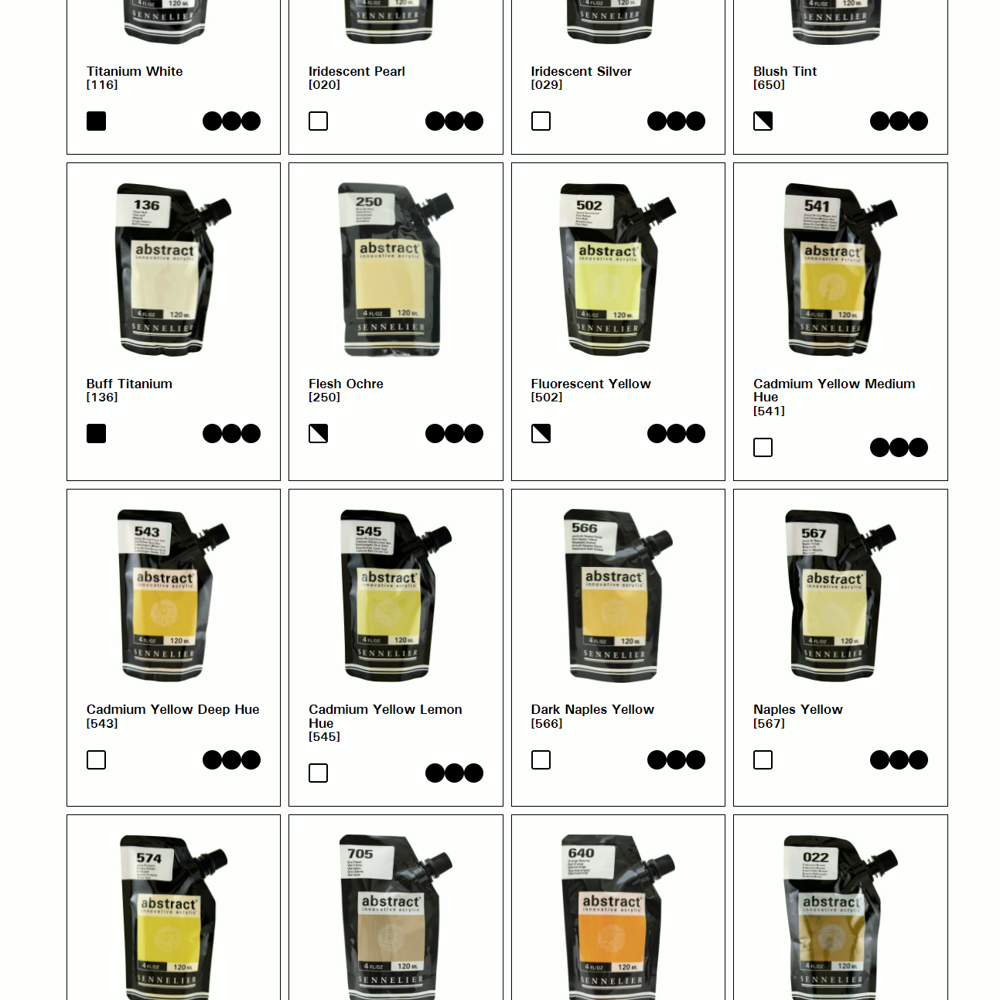

# Sennelier Web Page

👋 Hi, I’m @Jason-Smith-Code

👀 I’m interested in

- Programming (Javascript)
- Gaming ( RTS, FPS & ARPG's)

📫 How to reach me
https://www.linkedin.com/in/jason-smith-193674187/

## Description

This project was set by me, to take an existing webpage and re-design a page to better showcase its product.

The original page can be found here: http://www.sennelier-colors.com/en/Heavy-body-original-abstract_fiche_7372.html

## Objective

The main objective here was to familiarize myself CSS grid, and to make visual improvements in an alternative representation of an existing web page.
The site must be mobile optimised,
I avoided building the navigation menu as the project was mainly about using CSS grid.

## Screen Shots

Landing screen at

Product grid

## Project status

Complete

## View the project

https://jason-smith-code.github.io/sennelier-abstract-paint/
